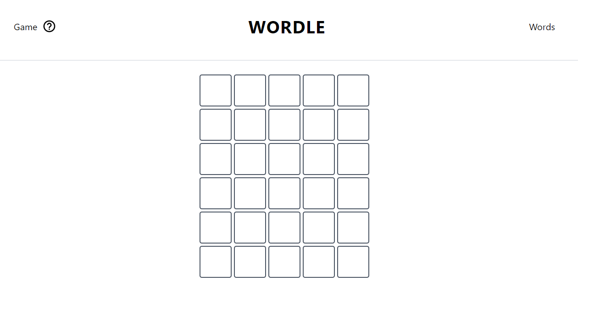
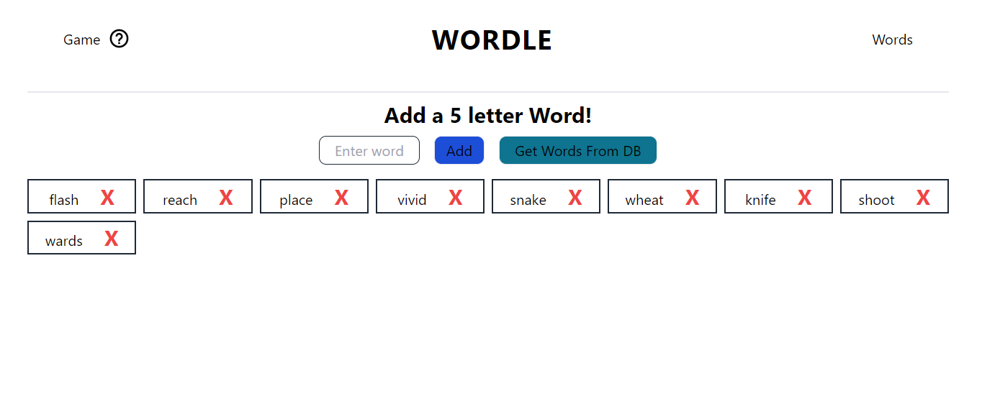
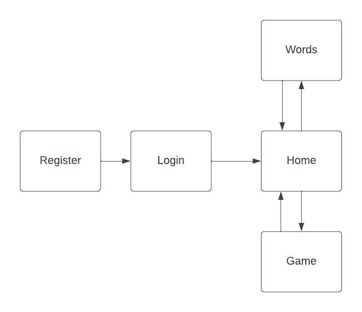

The content below is an example project proposal / requirements document. Replace the text below the lines marked "__TODO__" with details specific to your project. Remove the "TODO" lines.

# Guess the Word

## FOR FINAL MILESTONE: [heroku deployment](https://wordgame-app.herokuapp.com/)
### PROJECT STRUCTURE


## Overview

Yep, you guessed it (haha get it?), the main focus of my project is a word guessing game. 
The game will be similar to wordle (practically a clone), 
where the game consists of a 5 x 6 array and the user has 6 attempts to guess a 5-letter word.

This app functions as a game where users have to guess the correct word chosen by the game. 
Users can register and once they log in, they can add and remove words from the game given 
that they fulfill the requirements (for example newly added words must be 5-letters).

## Data Model

The application will store Users and Words

* users can have multiple words (via references) (these only include words that they have added to the database though)

An Example User:

```javascript
{
  username: "bigbob",
  hash: // a password hash,
  words: // an array of references to Word documents
}
```

An Example Word:

```javascript
{
  user: // a reference to a User object only filled if it is a user-added word, otherwise will be filled with 'default',
  text: "VIVID",
}
```


## [Link to Commented First Draft Schema](backend/models)

## Wireframes

'/' the home page which goes directly to the game



/wordlist - page for showing all words that can be possible solutions in the game




## Site map



## User Stories 

1. as a user, I can add words to the game as long as it contains 5 letters
2. as a user, I can delete words from the game, only when there are 10 or more words in the DB
3. as a user, I can view all the words that can be possible solutions to the game
4. as a user, I can play the game

## Research Topics

Subject to change

* (5 points) Integrate user authentication
    * I plan on using passport for user authentication
* (2 points) Use a CSS framework
    * Will either use Bootstrap or Tailwind.css to prettify the game / app
* (6 points) Reactjs
    * Used Reactjs as the frontend framework; I've assigned it 6 pts since I've been doing a lot more research than I expected initially.

13 points total out of 8 required points


## [Link to Initial Main Project File](backend/server.js) 

## Annotations / References Used

As the project goes on I will likely add and remove items from this list

1. [passport.js authentication docs](http://passportjs.org/docs) - (add link to source code that was based on this)
2. [reactjs tutorial](https://www.youtube.com/watch?v=w7ejDZ8SWv8) - (add link to source code that was based on this)
3. [connecting react to express backend](https://www.youtube.com/watch?v=kJA9rDX7azM) - (add link to source code that was based on this)
   1. [use of axios](https://github.com/nyu-csci-ua-0467-001-002-spring-2022/final-project-blin007/blob/16e5ce982f700ea54a7a6ab0d9a974a5d6a1364e/frontend/src/pages/Words.jsx#L15-L24)
   2. [proxy in package.json file](https://github.com/nyu-csci-ua-0467-001-002-spring-2022/final-project-blin007/blob/16e5ce982f700ea54a7a6ab0d9a974a5d6a1364e/frontend/package.json#L5)
4. [deploying with heroku](https://www.youtube.com/watch?v=5PaUiPyBDJY&t=747s)
   1. [process.env.PORT](https://github.com/nyu-csci-ua-0467-001-002-spring-2022/final-project-blin007/blob/eaba0a8a53f6ff4cedb72676b7de789c552cf230/backend/server.js#L12)
   2. [process.env.MONGODB_URI](https://github.com/nyu-csci-ua-0467-001-002-spring-2022/final-project-blin007/blob/eaba0a8a53f6ff4cedb72676b7de789c552cf230/backend/config/db.js#L6)
   3. [process.env.SESSION_SECRET](https://github.com/nyu-csci-ua-0467-001-002-spring-2022/final-project-blin007/blob/eaba0a8a53f6ff4cedb72676b7de789c552cf230/backend/server.js#L31)
   4. [package.json scripts](https://github.com/nyu-csci-ua-0467-001-002-spring-2022/final-project-blin007/blob/eaba0a8a53f6ff4cedb72676b7de789c552cf230/package.json#L8-L10)
   5. [process.env.NODE_ENV](https://github.com/nyu-csci-ua-0467-001-002-spring-2022/final-project-blin007/blob/eaba0a8a53f6ff4cedb72676b7de789c552cf230/backend/server.js#L50-L56)
5. [reactjs useEffect hook](https://www.youtube.com/watch?v=0ZJgIjIuY7U&list=LL&index=4&t=666s)
   1. [GameLogic.jsx window event listener](https://github.com/nyu-csci-ua-0467-001-002-spring-2022/final-project-blin007/blob/16e5ce982f700ea54a7a6ab0d9a974a5d6a1364e/frontend/src/components/GameLogic.jsx#L27-L33)
   2. [LayoutLogic.jsx](https://github.com/nyu-csci-ua-0467-001-002-spring-2022/final-project-blin007/blob/16e5ce982f700ea54a7a6ab0d9a974a5d6a1364e/frontend/src/components/LayoutLogic.jsx#L55-L155)
6. [reactjs tailwind to create modal](https://www.youtube.com/watch?v=ZCvemsUfwPQ)
   1. [EndGameModal.jsx](https://github.com/nyu-csci-ua-0467-001-002-spring-2022/final-project-blin007/blob/16e5ce982f700ea54a7a6ab0d9a974a5d6a1364e/frontend/src/components/EndGameModal.jsx#L6-L24)
7. [user input validation for word](https://stackoverflow.com/questions/3073176/javascript-regex-only-english-letters-allowed)
   1. [in words.jsx](https://github.com/nyu-csci-ua-0467-001-002-spring-2022/final-project-blin007/blob/052f81edba6ad9ec27abdd5c247ef7e0818ea58e/frontend/src/pages/Words.jsx#L11-L14)
8. [tailwind css animations](https://tailwindcss.com/docs/animation#customizing-your-theme)
   1. [in tailwind config file]()

