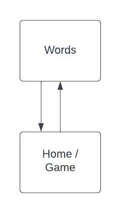

The content below is an example project proposal / requirements document. Replace the text below the lines marked "__TODO__" with details specific to your project. Remove the "TODO" lines.

# Guess the Word

## FOR MILESTONE 2: [heroku deployment](https://wordgame-app.herokuapp.com/)
### PROJECT STRUCTURE


## Overview

Yep, you guessed it (haha get it?), the main focus of my project is a word guessing game. However, I am still unsure as to what the specifics are. Currently, I am thinking of two possibilities.
The first one is some flashcard game where the game prompts the user with a definition of some word in the database, then the user has to guess that word based on the given definition.
The other possibility is something similar to wordle, where the game consists of a 5 x 6 array where the user has 6 attempts to guess a 5-letter word.

Regardless of the specifics of the game, the app "Guess the Word" functions as a game where users have to guess the correct word chosen by the game. 
Users can register and once they log in, they can add and remove words from the game given that they fulfill the requirements (for example in the wordle possibility, newly added words must be 5-letters).

## Data Model

The application will store Users and Words

* users can have multiple words (via references) (these only include words that they have added to the database though)

An Example User:

```javascript
{
  username: "bigbob",
  hash: // a password hash,
  words: // an array of references to Word documents
}
```

An Example Word (in a Wordle-like game):

```javascript
{
  user: // a reference to a User object only filled if it is a user-added word, otherwise will be filled with 'default',
  text: "VIVID",
}
```

An Example Word (in a flash-card-like game):

```javascript
{
  user: // a reference to a User object only filled if it is a user-added word, otherwise will be filled with 'default',
  text: "VIVID",
  def: 'producing powerful feelings or strong, clear images in the mind', //definition of the word
}
```


## [Link to Commented First Draft Schema](backend/config/db.js)

## Wireframes

'/home' welcome page with navbar leading to 'game' and 'words'


/home/words - page for showing all words in game


/home/game - page for the game

1) flashcard-game


2) wordle-game


## Site map



## User Stories or Use Cases

1. as non-registered user, I can register a new account with the site
2. as a user, I can log in to the site
3. as a user, I can add words to the game
4. as a user or nonuser, I can view all the words that can be used in the game
5. as a user or nonuser, I can play the game

## Research Topics

Subject to change

* (5 points) Integrate user authentication
    * I plan on using passport for user authentication
* (2 points) Use a CSS framework
    * Will either use Bootstrap or Tailwind.css to prettify the game / app
* (5 points) Reactjs
    * Used Reactjs as the frontend framework; I've assigned it 5 pts since I've heard that it is challenging

12 points total out of 8 required points


## [Link to Initial Main Project File](backend/server.js) 

## Annotations / References Used

As the project goes on I will likely add and remove items from this list

1. [passport.js authentication docs](http://passportjs.org/docs) - (add link to source code that was based on this)
2. [reactjs tutorial](https://www.youtube.com/watch?v=w7ejDZ8SWv8) - (add link to source code that was based on this)
3. [connecting react to express backend](https://www.youtube.com/watch?v=kJA9rDX7azM) - (add link to source code that was based on this)
4. [deploying with heroku](https://www.youtube.com/watch?v=5PaUiPyBDJY&t=747s) - (add link to source code that was based on this)
   1. [process.env.PORT](https://github.com/nyu-csci-ua-0467-001-002-spring-2022/final-project-blin007/blob/eaba0a8a53f6ff4cedb72676b7de789c552cf230/backend/server.js#L12)
   2. [process.env.MONGODB_URI](https://github.com/nyu-csci-ua-0467-001-002-spring-2022/final-project-blin007/blob/eaba0a8a53f6ff4cedb72676b7de789c552cf230/backend/config/db.js#L6)
   3. [process.env.SESSION_SECRET](https://github.com/nyu-csci-ua-0467-001-002-spring-2022/final-project-blin007/blob/eaba0a8a53f6ff4cedb72676b7de789c552cf230/backend/server.js#L31)
   4. [package.json scripts](https://github.com/nyu-csci-ua-0467-001-002-spring-2022/final-project-blin007/blob/eaba0a8a53f6ff4cedb72676b7de789c552cf230/package.json#L8-L10)
   5. [process.env.NODE_ENV](https://github.com/nyu-csci-ua-0467-001-002-spring-2022/final-project-blin007/blob/eaba0a8a53f6ff4cedb72676b7de789c552cf230/backend/server.js#L50-L56)
5. 

