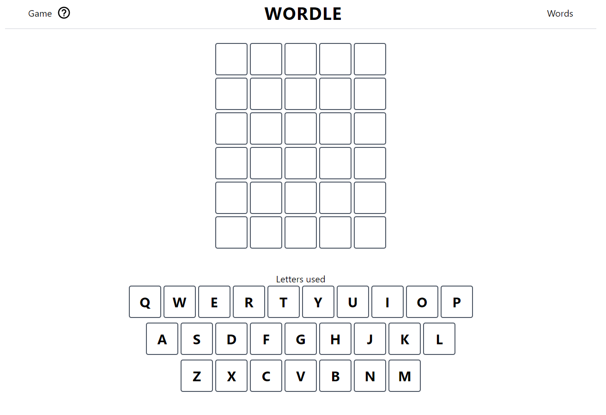

# Wordle Clone

## ~VIEW DEPLOYMENT: [heroku deployment](https://wordgame-app.herokuapp.com/)~
## Update: Due to free tier of heroku going away, the app is no longer deployed on heroku

### APP STRUCTURE


## Overview

This app functions as a game where users have to guess the correct word chosen by the game. 
Anyone can add and remove words from the game given 
that they fulfill the requirements (for example newly added words must be 5-letters).
Based on NY Times Wordle

## Data Model

The application will store Words which can be used as potential answers

An Example Word:

```javascript
{
  _id: //unique identifier for the word
  text: "VIVID",
}
```

## Wireframes

'/' the home page which goes directly to the game



/wordlist - page for showing all words that can be possible solutions in the game


## Site map


## User Stories 

1. Anyone can add words to the game as long as it contains 5 letters and the word is in the wordOptions.js file
2. Anyone can delete words from the game as long as there are 10 or more words in the DB
3. Anyone can view all the words that can be possible solutions to the game
4. Anyone can play the game
